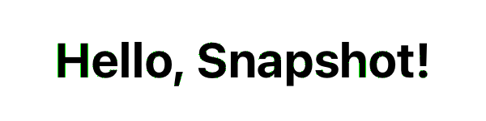

# AFSnapshotTesting
Is the world's [fastest library](#1-the-fastest-in-the-world) for creating snapshot tests of your visual components. Its main distinguishing feature is the use of [Apple metal computed shaders](https://developer.apple.com/documentation/metal/performing-calculations-on-a-gpu) to enable high-performance parallel `GPU` image analysis algorithms.

- The library offers an alternative testing strategy, as outlined in [cluster analysis](#2-cluster-analysis) which includes a parallel implementation that provides a **200x speed** increase compared to traditional `CPU` implementations. 

- The library also contains improved versions of popular testing strategies (deltaE2000).

- Open unique opportunities such as creating an accurate difference image [difference image](#features), which helps to identify problem areas. The difference image is created depending on the chosen algorithm. 
## Idea of ​​creation
The idea for the library came from my work on particle simulation using Apple Metal. By that time, I already had experience developing an internal corporate tool for snapshot testing and had a solid understanding of the operational features of existing open-source solutions, their technical limitations, and the problems they were designed to solve.

Having seen the impressive capabilities of Apple Metal for parallel processing of large volumes of data as particles and recognizing the potential to enhance existing approaches, a simple idea came to mind: to use pixels instead of particles.
## Example
```swift
import AFSnapshotTesting

class ExampleTests: XCTestCase {
    func testViewIphone14() {
        let view = View()
        assertSnapshot(view, on: .iPhone14)
    }

    func testViewSomeSize() {
        let view = View()
        assertSnapshot(view, on: (size: CGSize(width: 100, height: 300), scale: 3))
    }

    func testDarkMode() {
        let traits = [ UITraitCollection(userInterfaceStyle: .dark) ]
        assertSnapshot(view, on: .iPhone14, traits: traits)
    }
}
```

## Installation
### Swift Package Manager
```swift
dependencies: [
    .package(
        url: "https://github.com/afanasykoryakin/apple-metal-snapshot-testing",
        from: "1.0.0"
    )
]
```
## Features
1. **Automatic Difference Detection**  
   When a snapshot test fails, a `difference` image is automatically generated to highlight discrepancies. Use the color selection parameter to adjust the visual representation of differences between the reference and the actual snapshot. This makes it easy to identify changes.

   ```swift
   // Example usage
   assertSnapshot(..., differenceColor: .green)
   ```

   

    Thanks to unique technologies, **the image is generated accurately depending on the selected algorithm**.

2. **Customizable Pixel Tolerance**  
   Fine-tune your tests by setting a threshold for the allowable number of non-matching pixels. You can control pixel clusters' size and define tolerances to eliminate false positives caused by minor visual discrepancies. [new settings](#3-discrete-settings)

    ```swift
    🙁
    //PointFree SnapshotTesting:
    assertSnapshot(as: .image(precision: 0.999999999))
    ```
    ```swift
    😎
    // AFSnapshotTesting 
    // Ignore 10 pixels allright 
    assertSnapshot(as: .naive(threshold: 10))
    ```

3. **Automatic Reference Creation**  
   When running tests for the first time, the library automatically creates reference images for future comparisons.

4. **Multiple Tests in a Single Test Case (using `named`)**  
   
   The `named` parameter allows you to run multiple snapshot tests within a single test case. This is useful for testing different states of a UI component, such as after a button press or other interactions, without needing to split them into separate test cases.

    ```swift
    func testInteraction() {
       // Example usage with `named`
	   assertSnapshot(view, named: "initialState")
	   // Simulate button press
	   assertSnapshot(view, named: "afterButtonPress")
    }
    ```

5. **[Minimizing the Impact of Rendering Variations Across Different Processors and Operating Systems](#2-minimizing-the-impact-of-rendering-variations-across-different-processors-and-operating-systems)** 
    
    Emissions issues are fundamental to snapshot testing tools ([readmore](#2-minimizing-the-impact-of-rendering-variations-across-different-processors-and-operating-systems)). 

    - Pixel tollerance with CIE2000 Delta-E ([readmore](#12-perceptual-tollerance-strategy))
    ```swift
    // ✅ threshold: 10 - Ignore 10 pixels allright. But now, let’s add a threshold of deltaE = 1.0, which means we ignore differences that are imperceptible to the human eye.
    assertSnapshot(as: .perceptualTollerance(threshold: 10,  deltaE: 1.0))  

    // 🔙 For full backwards compatibility for pointfree
    assertSnapshot(as: .perceptualTollerance_v2(precission: 0.999, perceptualPrecision: 0.99))
    ```
    - [Cluster analysis strategy](#11-clusters-strategy)
    ```swift
    assertSnapshot(as: .cluster(threshold: 0, clusterSize: 2))
     ```
## Distinctive Features
### 1. The fastest in the world
 AFSnapshotTesting executes 1000 tests 2.3x times faster than PointFree's [swift-snapshot-testing](https://github.com/pointfreeco/swift-snapshot-testing) v1.16.0, leveraging parallel computations on the GPU to achieve higher performance.


#### 1.1 Testing Environment
The performance and accuracy of the tests were evaluated in a new SPM module, which includes dependencies on AFSnapshotTesting v1.0.0 and  [swift-snapshot-testing](https://github.com/pointfreeco/swift-snapshot-testing) v1.16.0.

Speed is certainly a useful advantage, but it’s not the primary focus. Instead, consider other unique features like integer threshold parameters, [cluster analysis](#11-clusters-strategy), and true difference images.
##### 1.1.1 Testing Environment
1. XCode 15.3 + Sumulator iOS;
2. Macbook Pro 14" 2021, Apple M1 PRO, 16GB;
3. MacOS Sonoma 14.1;

- Testing was conducted on a hot build.
- The test plan included parallel execution mode, with each test class containing 10 tests.
- `memcpu` optimizations were disabled in the source code of [swift-snapshot-testing](https://github.com/pointfreeco/swift-snapshot-testing) v1.16.0. (see. [1.1.3 Simulating Outliers](#113-simulating-outliers))
##### 1.1.2 Test Parameters
1. Creation of a graphical component with a resolution of 1170 × 2532, equivalent to the iPhone 14 screen;
2. Gradient setup;
3. For [SnapshotTesting](https://github.com/pointfreeco/swift-snapshot-testing) v1.16.0.  `perceptualPrecision: 0.99`;
4. For AFSnapshotTesting `СlusterStrategy`;
##### 1.1.3 Simulating Outliers
[swift-snapshot-testing](https://github.com/pointfreeco/swift-snapshot-testing) v1.16.0 includes optimization that allow bypassing comparison and outlier handling algorithms when they are not necessary. For the sake of experimentation, it was decided to modify the library's source code to disable these optimization.

In the file `UIImage.swift`, changes were made by commenting out lines 118 and 129 to exclude them from the compilation process:

```swift
if memcmp(oldData, newData, byteCount) == 0 { return nil }
```

The `memcmp` optimization quickly compares two memory blocks of the same length and returns 0 if they are identical. If the memory blocks of the reference snapshot and the render are exactly the same, the algorithms can be skipped.
### 2. Minimizing the Impact of Rendering Variations Across Different Processors and Operating Systems
  

Difference when trying to compare on iPhone 15pro simulator **iOS 18 vs. iOS 17.2**. (XCode15.3, macbook m1 pro)

#### 1.1 Clusters strategy
Existing algorithms for minimizing the impact of outliers, primarily based on approaches similar to color blindness (deltaE2000), are already quite fast. While a significant increase in speed is a welcome improvement, it is not critically important.

**The key achievement is the creation of a parallel algorithm for minimizing the impact of outliers on the GPU, based on the analysis of the size of [interconnected clusters](https://courses.cs.washington.edu/courses/cse576/book/ch3.pdf).**

By nature, outliers are usually isolated or form small clusters, which is significantly different from the differences caused by actual changes in development.

The idea of using cluster analysis is not entirely new. Existing approaches receive positive feedback as a method for minimizing outliers, but they are critically slow.

In traditional `CPU`-based implementations, it takes an average of 1 second to perform a single test. This means that running a thousand tests would take approximately 16.6 minutes. The parallel implementation on the `GPU` performs the same work in 5 seconds, which is 200 times faster.
#### Grouping Significant Changes
- The cluster analysis algorithm looks at a non-matching pixel and checks if it's isolated or part of a cluster. This helps determine whether the changes are part of a larger modification (such as a component redesign) or just random, isolated changes. In this way, cluster analysis helps identify the nature of UI changes and reduces the number of false test failures.

*P.S. Color blindness-based analysis is the industry standard, and not everyone may want to move away from it. The existing modular architecture allows for the creation of the CIED2000 color sensitivity algorithm as a separate testing strategy. Additionally, you can create combined algorithms that incorporate both color blindness analysis and cluster analysis, which will provide even greater accuracy and effectiveness.*
#### 1.2 Perceptual tollerance strategy

Perceptual tolerance refers to an image comparison method that accounts for human visual perception. It ignores minor rendering differences that would be indistinguishable to the human eye. 

Perceptual tolerance-based algorithms [Delta E (CIE 2000)](http://www.brucelindbloom.com/index.html?Eqn_DeltaE_CIE2000.html) have become the industry standard for snapshot testing (thanks to PointFree's [swift-snapshot-testing](https://github.com/pointfreeco/swift-snapshot-testing)), allowing developers to minimize false positives caused by minor rendering differences across platforms. Given its widespread adoption, I have also implemented a similar algorithm. 

```swift
// PointFree SnapshotTesting:
// precision: 0.999 - the image should match 99%, but this is a relative parameter that will cause difficulties
assertSnapshot(as: .image(precision: 0.999, perceptualPrecision: 0.99))
```

```swift
😎
// AFSnapshotTesting 
// ✅ threshold: 10 - Ignore 10 pixels allright 
assertSnapshot(as: .perceptualTollerance(threshold: 10))  

// ✅ threshold: 10 - Ignore 10 pixels allright. But now, let’s add a threshold of deltaE = 1.0, which means we ignore differences that are imperceptible to the human eye.
assertSnapshot(as: .perceptualTollerance(threshold: 10, deltaE: 1.0))  

// For full backwards compatibility for pointfree.
assertSnapshot(as: .perceptualTollerance_v2(precission: 0.999, perceptualPrecision: 0.99))
```
- 250% faster than pointfree
## Resume
Thank you. my [tg](https://t.me/afanasykoryakin)
## License
License: MIT, https://github.com/afanasykoryakin/AFSnapshotTesting/blob/master/LICENSE